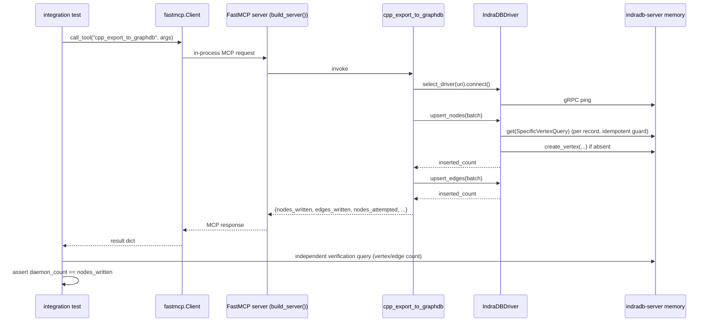

# v4 Design — Real End-to-End Tests + v3 Post-Ship Bug Fixes

**Status:** accepted
**Date:** 2026-05-17
**run_id:** cpp-mcp-v4
**Architect:** Claude (Opus 4.7)
**Inputs:** [requirements.md](requirements.md), [scenarios.md](scenarios.md)
**Predecessor design:** `.claude/handoff/v3/design.md` (ADR-7, ADR-12..15)

---

## 1. Scope recap

Seven user stories spanning three concerns:

1. **Test harness** (US-V4-1): in-process `fastmcp.Client(build_server())` fixture.
2. **Real backend coverage** (US-V4-2): env-gated end-to-end IndraDB export with assertions against the live daemon.
3. **Five v3 ship defects** (US-V4-3..7): insert-vs-attempt metrics, `protobuf<4` pin, `Identifier → str` patch, broken Docker image, README extras + `DEPENDENCY_MISSING` ergonomics.

No new backends, no CI wiring, no live Neo4j tests (deferred to v5).

---

## 2. Cross-cutting decisions

Three ADRs are filed alongside this design — they bind all seven stories:

| ADR | Decision | Stories bound |
|---|---|---|
| [ADR-16](adr-16.md) | Local IndraDB distribution = `cargo install indradb` (no Docker, no registry image) | US-V4-2, US-V4-6 |
| [ADR-17](adr-17.md) | `nodes_written` / `edges_written` count **inserts only**; attempts are exposed as separate optional fields | US-V4-2, US-V4-3 |
| [ADR-18](adr-18.md) | Test harness uses `fastmcp.Client(server_instance)` in-process transport; session-scoped fixture | US-V4-1, US-V4-2, US-V4-7 |

All three ADRs are `Status: accepted`.

---

## 3. Component-level design

### 3.1 Test harness (US-V4-1)

```
tests/
├── conftest.py                 # adds session-scoped mcp_client fixture
├── integration/                # NEW directory
│   ├── __init__.py
│   ├── conftest.py             # adds indradb_daemon, indradb_uri fixtures
│   ├── test_harness_smoke.py   # SC-V4-1-01, SC-V4-1-02
│   ├── test_all_tools_smoke.py # SC-V4-1-03 (parametrised over 7 tools)
│   ├── test_indradb_e2e.py     # SC-V4-2-01..04, SC-V4-3-01..02
│   ├── test_install.py         # SC-V4-4-01, SC-V4-4-02
│   ├── test_indradb_driver_patch.py  # SC-V4-5-01
│   ├── test_docker_fixture.py  # SC-V4-6-01, SC-V4-6-02
│   └── test_readme_extras.py   # SC-V4-7-01, SC-V4-7-02
└── fixtures/                   # existing — modified per US-V4-6
```

**Fixture wiring (per [ADR-18](adr-18.md)):**

```python
# tests/conftest.py  (addition; rest of file unchanged)
import pytest
import pytest_asyncio
from fastmcp import Client
from cpp_mcp.server.app import build_server

@pytest_asyncio.fixture(scope="session")
async def mcp_client():
    server = build_server()
    async with Client(server) as client:
        yield client
```

- Scope is `session` per AC-1-1; `build_server()` is idempotent and tools' state (ClangSession) is process-local — sharing is safe.
- `asyncio_mode = "auto"` is already enabled in pyproject; tests are `async def`.
- The fixture spawns no subprocess (verified by AC-1-1 prose + the `Client(server_instance)` API contract).

**Marker discipline (AC-1-4, AC-1-5):**

- Register `integration` in `pyproject.toml` `[tool.pytest.ini_options].markers`.
- Add to `addopts`: `-m "not integration"` so default `uv run pytest` skips integration cleanly.
- Override by `uv run pytest -m integration` or `uv run pytest -m "integration and not indradb"` etc.

**Smoke test for cache (AC-1-2, SC-V4-1-02):** call `cpp_get_ast` twice with identical args; assert `cache_hit` toggles `False → True`. The ClangSession is session-scoped across the same `mcp_client` lifetime, so cache state persists.

**Seven-tool parametrised smoke (AC-1-3, SC-V4-1-03):** one parametrised test invoking each tool name with the minimum valid args; assert no MCP error envelope and at least one result key. For `cpp_export_to_graphdb` use an in-process **fake** driver URI (`memory://` not supported — instead use `indradb://` and let it fail-skip if no daemon, OR use the existing `tests/fixtures/fake_indradb.py`). **Decision:** the parametrised smoke uses `db_uri="bolt://invalid"` with an assertion that the response is a structured error envelope (`DB_UNREACHABLE` or `DEPENDENCY_MISSING`) — that exercises the dispatch path through real MCP without requiring a daemon. The deep `cpp_export_to_graphdb` happy-path is covered by US-V4-2.

### 3.2 IndraDB end-to-end fixture (US-V4-2)

```python
# tests/integration/conftest.py
import os, socket, subprocess, time, pytest

@pytest.fixture(scope="session")
def indradb_uri():
    uri = os.getenv("INDRADB_TEST_URI")
    if not uri:
        pytest.skip("INDRADB_TEST_URI is required for @indradb tests")
    return uri

@pytest.fixture(scope="session")
def indradb_daemon(indradb_uri):
    """Autostart indradb-server when INDRADB_AUTOSTART=1; otherwise probe-and-skip."""
    host, port = _parse(indradb_uri)
    autostart = os.getenv("INDRADB_AUTOSTART") == "1"
    proc = None
    if autostart:
        proc = subprocess.Popen(
            ["indradb-server", "memory"],
            stdout=subprocess.DEVNULL, stderr=subprocess.DEVNULL,
        )
        _wait_for_port(host, port, timeout=10)
    else:
        if not _port_open(host, port, timeout=2):
            pytest.skip(f"No IndraDB daemon on {host}:{port} and INDRADB_AUTOSTART != 1")
    try:
        yield indradb_uri
    finally:
        if proc is not None:
            proc.terminate()
            proc.wait(timeout=5)

@pytest.fixture
def fresh_indradb(indradb_daemon):
    """Per-test fixture that wipes the daemon's state before yielding."""
    _wipe(indradb_daemon)
    yield indradb_daemon
```

**Why a `memory` daemon (not `rocksdb`):** RAM-only, fresh on every fixture setup, no volume cleanup needed, and the `cargo install indradb` binary ships `memory` as the default subcommand. RocksDB path is reserved for production / longer-lived test rigs.

**Why per-test `fresh_indradb` (wipes state):** AC-2-3 expects exact pinned vertex/edge counts; AC-2-4 expects idempotent re-export to return 0. Both depend on a known-empty starting state. Wipe is via the indradb client's `get_all_vertices` → `delete_vertices` (the daemon offers no `RESET` RPC).

**Port choice:** 27615 (IndraDB upstream default). Confirmed in `indradb_driver.py` `_DEFAULT_PORT`.

### 3.3 Insert-vs-attempt metric semantics (US-V4-3)

Per [ADR-17](adr-17.md):

**GraphDriver Protocol change** (`src/cpp_mcp/graphdb/driver.py`):

```python
def upsert_nodes(self, batch: list[NodeRecord]) -> int:
    """Return the number of nodes ACTUALLY CREATED.
    A repeated upsert of identical (label, usr) returns 0 (idempotent)."""
def upsert_edges(self, batch: list[EdgeRecord]) -> int:
    """Return the number of edges ACTUALLY CREATED.
    A repeated upsert of identical (src, type, tgt) returns 0."""
```

Docstring shifts from "created or updated" → "created only". This is a **contract tightening**, not a signature change; both existing call sites (`exporter.py:511-512`) consume an `int` and forward it as `nodes_written` / `edges_written`.

**IndraDB driver implementation strategy** (`indradb_driver.py`):

Two options were considered:

1. **Pre-existence check** (`get_vertices(SpecificVertexQuery(vid))` → if empty, create and count). Two RPCs per node; simple; correct.
2. **Post-creation delta** (compare `count_vertices` before/after batch). One bulk RPC; but cannot disambiguate per-record in case of partial failures.

**Chosen: option 1**, scoped per record. The latency cost (~2× RPCs) is acceptable because: (a) exports are batch operations dwarfed by libclang parse time, and (b) the alternative requires changes to the `indradb` Python API surface we don't control.

Pseudocode (production code in `senior-developer` plan):

```python
def upsert_nodes(self, batch):
    inserted = 0
    for rec in batch:
        vid = uuid.uuid5(NS_CPPMCP_USR, rec["usr"])
        existing = list(self._client.get(indradb.SpecificVertexQuery(vid)))
        if not existing:
            self._client.create_vertex(indradb.Vertex(vid, rec["label"]))
            inserted += 1
        # properties always overwritten (ADR-15); does not affect count
        for k, v in {**rec["props"], "usr": rec["usr"]}.items():
            self._client.set_properties(indradb.SpecificVertexQuery(vid), name=k, value=_normalise_prop(k, v))
    return inserted
```

Edge variant uses `SpecificEdgeQuery(edge)` with the same pattern.

**Neo4j driver** (AC-3-3 — code-review only, no live test):

The current Neo4j driver (`neo4j_driver.py:88-91, 121-124`) counts `RETURN n` rows, which is **attempt-counting** — MERGE returns the matched row whether it was created or merely matched. This is the **same bug** the IndraDB driver has.

**Fix in scope for US-V4-3** (per ADR-17 §Consequences): use Neo4j's transaction counters:

```python
result = tx.run(query, ...)
result.consume()                       # exhaust
summary = result.consume()             # get ResultSummary
written += summary.counters.nodes_created      # or .relationships_created
```

This is verified by code review and committed alongside the IndraDB fix; no live daemon test is required (out-of-scope per requirements §Out of Scope). Surface the fix in `logs/developer-us-v4-3.md` per AC-3-3.

**Optional `nodes_attempted` / `edges_attempted` (AC-3-2):** the exporter (`graphdb/exporter.py:504-514`) already returns a dict; extend it to:

```python
return {
    "nodes_written": nodes_written,
    "edges_written": edges_written,
    "nodes_attempted": len(nodes),
    "edges_attempted": len(edges),
}
```

…and propagate up through `tools/export_to_graphdb.py` (lines 116-117, 134-135). These are documented in the tool docstring.

### 3.4 `protobuf<4` pin (US-V4-4)

`pyproject.toml` `[project.optional-dependencies]`:

```toml
graphdb-indradb = ["indradb>=3.0,<4", "protobuf<4"]
```

This is a **transitive-dependency pin** — the upstream `indradb` 3.0.1 wheel does not pin protobuf, but its generated stubs were built against protobuf 3.x and break on import with `protobuf>=4`. The pin is documented in [ADR-18](adr-18.md) §Consequences with a reference to defect 1 of `[[project-graphdb-v3-post-ship-findings]]`.

Test (`tests/integration/test_install.py`): import-only, no daemon. Marked `@pytest.mark.integration`. Per AC-4-3 the CI run does not need a network call — the venv is built once at install time.

### 3.5 `Identifier → str` patch (US-V4-5)

Lines 143, 177 of `indradb_driver.py` already have the working-tree fix (per the `git status` output showing the file as modified). The developer commits as-is plus the docstring cleanup at lines 8, 10. Structural test in `tests/integration/test_indradb_driver_patch.py` greps the file for `indradb.Identifier` and asserts no match.

This story is the **non-negotiable prerequisite** for US-V4-2 to pass — every export call hits `AttributeError` otherwise.

### 3.6 Docker fixture replacement (US-V4-6)

Per [ADR-16](adr-16.md): **delete** `tests/fixtures/indradb-compose.yml`. Replace with:

- README `## Local development (IndraDB)` subsection: `cargo install indradb` + `indradb-server memory`.
- Update `.claude/handoff/v3/runbook.md` references to the broken image.
- Add a structural test that asserts the broken image string `indradb/indradb:5.0.0` is **absent** from the repo (greps the working tree).

The deleted compose file is recorded in `plan.md` `files-to-touch` with action `delete`.

### 3.7 README install + `DEPENDENCY_MISSING` ergonomics (US-V4-7)

- README `## Installation` lists three extras with `uv sync --extra <name>` examples.
- The current `DependencyMissingError` message in `indradb_driver.py:107-110` already says `pip install "cpp-mcp[graphdb-indradb]"`. Per AC-7-2, update the wording to also mention the `uv sync --extra graphdb-indradb` form, since the test (SC-V4-7-02) asserts the literal string `--extra graphdb-indradb` is present:

```python
raise DependencyMissingError(
    'indradb Python driver is not installed. Install with: '
    'uv sync --extra graphdb-indradb  '
    '(or: pip install "cpp-mcp[graphdb-indradb]")'
)
```

Mirror the same wording for the Neo4j driver (`--extra graphdb-neo4j`).

---

## 4. Data flow / sequence



---

## 5. Failure modes and mitigations

| Failure | Likelihood | Mitigation |
|---|---|---|
| `indradb-server` binary not in PATH on a dev's machine | high | `INDRADB_AUTOSTART=1` fixture skips with clear message including the install command from ADR-16 |
| Per-record existence check (ADR-17) doubles RPC count → slow on large repos | medium | `os.cc` is the only fixture; full-repo exports remain a v5 concern. Mitigation cost is recorded in ADR-17 §Consequences |
| `fastmcp.Client(server)` in-process API breaks in a future fastmcp release | low | `fastmcp~=3.1.0` pin in pyproject; SC-V4-1-01 fails loudly if the constructor signature changes |
| `protobuf<4` conflicts with a future direct dependency that needs protobuf>=4 | low | Documented in ADR-18; revisit only when a real conflict surfaces |
| Pinned vertex/edge counts (OQ-2-1) drift on libclang upgrade | medium | QA records the values in `scenarios.md` (not source); a libclang bump becomes a deliberate AC update, not a silent break |
| Neo4j MERGE counter fix not exercised by a live test (AC-3-3, OQ-3-1) | medium | Code-review check is documented in `logs/developer-us-v4-3.md`; v5 will add a Neo4j daemon |
| Existing v3 BDD scenarios (`SC_US_G5_*` in pyproject) assume `len(batch)` semantics — they may now fail | medium | The v3 BDD tests use `fake_indradb.py` which the developer must update to also return insert counts. Listed in plan.md files-to-touch |

---

## 6. Out-of-scope (re-confirmed)

- Live Neo4j daemon tests (deferred to v5).
- GitLab CI wiring (deferred to v5).
- Memgraph / Kuzu / Cognee backend additions.
- Performance benchmarks for the doubled-RPC IndraDB path.
- Network fault injection (timeouts, TLS, partial writes).

---

## 7. References

- [requirements.md](requirements.md)
- [scenarios.md](scenarios.md)
- [ADR-16](adr-16.md), [ADR-17](adr-17.md), [ADR-18](adr-18.md)
- `[[project-graphdb-v3-post-ship-findings]]`
- `[[project-graphdb-multi]]`
- `[[project-fastmcp-migration]]`
- `src/cpp_mcp/graphdb/{driver.py,indradb_driver.py,neo4j_driver.py,exporter.py,__init__.py}`
- `src/cpp_mcp/server/app.py` (`build_server()`)
- v3 ADRs: `.claude/handoff/v3/{adr-12,adr-13,adr-14,adr-15}.md`
